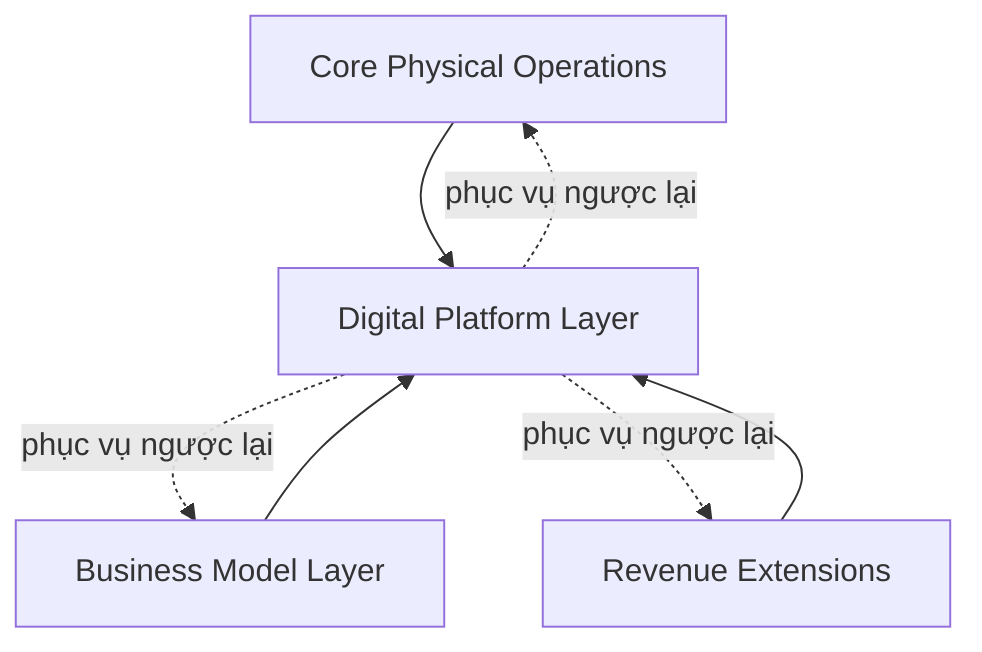

# AMZ_OS.md — Cấu trúc Hệ điều hành AMZ

> **Trạng thái:** ĐỀ XUẤT (v2.1 — bản tối giản)
> **Ngày:** 2026-07-04
> **Nguồn sự thật doanh nghiệp:** `AMZ_BUSINESS_BLUEPRINT.md`

**Tài liệu này chỉ làm một việc:** giải thích AMZ được tổ chức ra sao ở cấp cao nhất. Nó không chứa chi tiết kỹ thuật, schema dữ liệu, API, quy trình deploy hay danh sách tính năng — những nội dung đó thuộc về các tài liệu chuyên biệt khác (xem mục 6).

---

## 1. AMZ gồm những thành phần nào

AMZ gồm 7 thành phần kinh doanh (domain), lấy từ `AMZ_BUSINESS_BLUEPRINT.md`:

| Domain | Vai trò một dòng |
|---|---|
| **Pickleball** | Cho thuê sân, chơi và tập luyện Pickleball |
| **Cà phê** | Dịch vụ ăn uống gắn liền với không gian sân |
| **Giải đấu & Sự kiện** | Tổ chức thi đấu, sự kiện cộng đồng và doanh nghiệp |
| **Hội viên** | Cơ chế gắn kết và ưu đãi dài hạn cho khách hàng |
| **Bán lẻ** | Bán dụng cụ, phụ kiện, trang phục Pickleball |
| **Truyền thông** | Nội dung, thương hiệu, kênh truyền thông của AMZ |
| **Nền tảng số** | Công nghệ phục vụ toàn bộ các hoạt động trên |

Không có domain nào ngoài 7 domain này. AI **không** phải một domain — xem mục 5.

---

## 2. Tổ chức theo 4 tầng

| Tầng | Domain thuộc tầng này |
|---|---|
| **Core Physical Operations** | Pickleball · Cà phê · Giải đấu & Sự kiện |
| **Business Model Layer** | Hội viên |
| **Revenue Extensions** | Bán lẻ · Truyền thông |
| **Digital Platform Layer** | Nền tảng số |

---

## 3. Vai trò của từng tầng

**Core Physical Operations** — nơi tạo ra doanh thu chính hiện tại. Đây là hoạt động thật, đang vận hành, không phải kế hoạch.

**Business Model Layer** — không tự tạo doanh thu độc lập; nó là cơ chế gắn kết khách hàng (ưu đãi, tích điểm, quyền lợi) áp dụng lên trên các hoạt động ở Core Physical Operations.

**Revenue Extensions** — mở rộng doanh thu ngoài hoạt động cốt lõi. Đây là cơ hội tăng trưởng đã được xác nhận, nhưng chưa phải trụ cột hiện tại.

**Digital Platform Layer** — hạ tầng công nghệ dùng chung, tồn tại để phục vụ ba tầng còn lại vận hành tốt hơn — bản thân nó không phải mục đích cuối cùng của AMZ.

---

## 4. Các tầng liên kết với nhau như thế nào

Nguyên tắc liên kết:

- **Business Model Layer phủ lên Core Physical Operations**, không đứng độc lập — mọi quyền lợi hội viên đều tham chiếu tới Pickleball, Cà phê, hoặc Giải đấu & Sự kiện.
- **Digital Platform Layer phục vụ cả ba tầng còn lại**, không phải một hoạt động kinh doanh song song với chúng.
- **Trong Core Physical Operations, Pickleball và Giải đấu & Sự kiện phải dùng chung một nguồn sự thật duy nhất cho thông tin sân/lịch** — không domain nào được tự giữ một bản sao riêng, để tránh phát sinh nhiều nguồn sự thật khác nhau cho cùng một thông tin.
- **Trong Revenue Extensions, Truyền thông chịu trách nhiệm về nội dung và chiến lược truyền thông; Nền tảng số chịu trách nhiệm về hạ tầng vận hành phục vụ nội dung đó** — hai domain này bổ trợ nhau, không tranh chấp vai trò.

---

## 5. Vai trò xuyên suốt của Data và AI

**Data** không thuộc riêng tầng nào — nó là tài sản xuyên suốt mọi tầng. Nguyên tắc duy nhất: mỗi loại thông tin chỉ có **một nguồn sự thật**, dùng chung giữa các domain liên quan, thay vì mỗi domain tự giữ một bản sao.

**AI** cũng xuyên suốt mọi tầng, không phải một domain kinh doanh. Vai trò của AI là hỗ trợ con người ra quyết định và vận hành tốt hơn ở cả 4 tầng — AI không tự quyết định các vấn đề tài chính, không tự thay đổi dữ liệu khách hàng, và không tự triển khai thay đổi mà chưa có người phê duyệt.

---

## 6. Nguồn sự thật và thứ tự ưu tiên tài liệu

| Tài liệu | Vai trò |
|---|---|
| **`AMZ_BUSINESS_BLUEPRINT.md`** | Nguồn sự thật cao nhất về mọi quyết định kinh doanh (tầm nhìn, mô hình, doanh thu, khách hàng, dữ liệu, AI, công nghệ) |
| **`AMZ_OS.md`** (tài liệu này) | Bản đồ cấu trúc — chỉ giải thích các thành phần tổ chức và liên kết ra sao, không tạo thêm sự thật kinh doanh mới |
| Các tài liệu chuyên biệt khác (kiến trúc, dữ liệu, bảo mật, quy trình phát triển, quy trình phối hợp AI...) | Nguồn chuẩn cho lĩnh vực kỹ thuật riêng của chúng — không bị lặp lại ở đây |

**Thứ tự ưu tiên khi có mâu thuẫn:**
1. `AMZ_BUSINESS_BLUEPRINT.md` thắng về mọi sự thật kinh doanh.
2. Tài liệu chuyên biệt thắng về chi tiết kỹ thuật trong phạm vi của nó.
3. `AMZ_OS.md` không có thẩm quyền ghi đè lên hai loại trên — nó chỉ tổ chức lại cách nhìn tổng thể.
