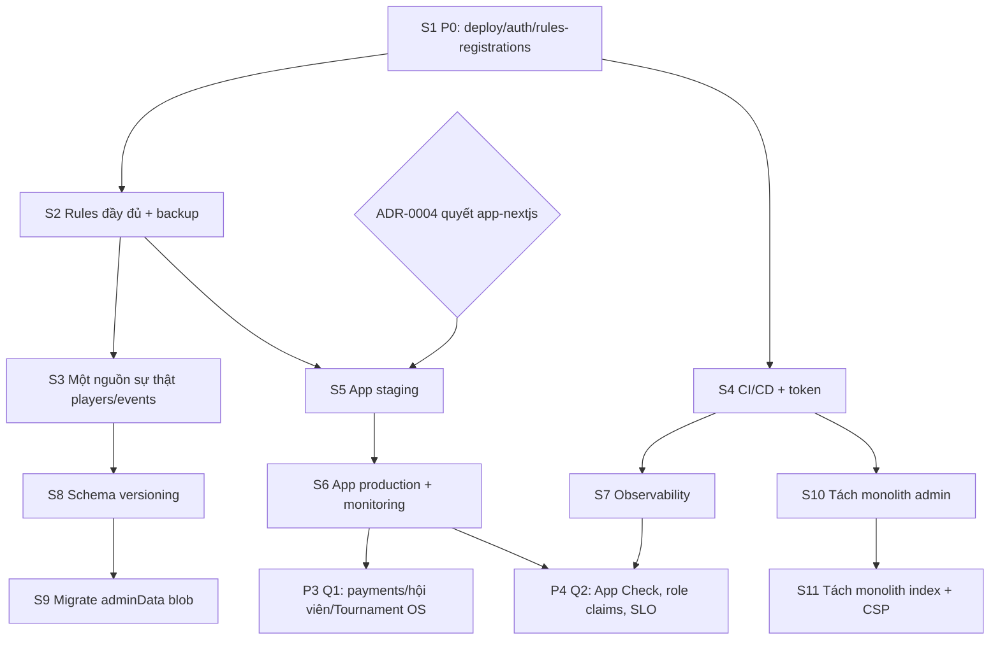

# MASTER_ROADMAP.md — AMZ Pickleball (12 tháng)

> Lộ trình 2026-07 → 2027-06. Sprint = 2 tuần. Cập nhật: 2026-06-30. Vai trò: CTO / Lead Architect.
> Nguồn: `TECH_DEBT.md`, `SPRINT_PLAN.md`, `docs/adr/`, `docs/design/`.
> Nguyên tắc: **bảo mật & ổn định trước → một nguồn sự thật → quy trình → tính năng → tối ưu**. Không tính năng mới khi nền chưa vững.

---

## 1. Tổng quan 4 phase

| Phase | Quý | Chủ đề | Kết quả then chốt |
|---|---|---|---|
| **P1 — Stabilize & Secure** | Q3 2026 (T7–T9) | Vá P0, hoàn thiện rules, một nguồn sự thật, quyết app-nextjs | Hệ thống an toàn, dữ liệu nhất quán |
| **P2 — Consolidate & Observe** | Q4 2026 (T10–T12) | CI/CD, monitoring, versioning, dọn nợ bảo trì | Vận hành quan sát được, ít nợ |
| **P3 — Scale Features** | Q1 2027 (T1–T3) | (Nếu deploy app) đặt sân/giải đấu/hội viên GA | Phần động chạy production |
| **P4 — Optimize & Harden** | Q2 2027 (T4–T6) | App Check, role-claims, hiệu năng, SLO | Trưởng thành vận hành |

---

## 2. Bản đồ sprint chi tiết

| Sprint | Khoảng (2026/27) | Theme | Hạng mục chính (TD/ADR) | Phụ thuộc |
|---|---|---|---|---|
| **S1** | 01–14/07 | Khoá lỗ hổng P0 | TD-01, TD-02, TD-03 + gates | — (nền tảng) |
| **S2** | 15–28/07 | Nền móng dữ liệu | TD-04 (rules đầy đủ), ADR-0004, backup | S1 |
| **S3** | 29/07–11/08 | Một nguồn sự thật | TD-06 (chuẩn hoá players), ADR-0002 | S2 |
| **S4** | 12–25/08 | Quy trình & chất lượng | TD-07, TD-08, TD-10, TD-11 | S1 |
| **S5** | 26/08–08/09 | (Nếu chọn deploy app) Triển khai app-nextjs staging | TD-05, DESIGN-firestore-rules | S2, ADR-0004 |
| **S6** | 09–22/09 | App-nextjs production + monitoring | TD-05, MONITORING | S5 |
| **S7** | 23/09–06/10 | Observability đầy đủ | MONITORING (uptime/log/metrics) | S4 |
| **S8** | 07–20/10 | Schema versioning | DATABASE_VERSIONING, TD-09 (bắt đầu) | S3 |
| **S9** | 21/10–03/11 | Migrate `settings/adminData` blob | TD-09 | S8 |
| **S10** | 04–17/11 | Tách monolith (đợt 1: admin.html JS/CSS) | TD-13 | S4 |
| **S11** | 18/11–01/12 | Tách monolith (đợt 2: index.html) + CSP siết | TD-13, SECURITY #6 | S10 |
| **S12** | 02–15/12 | Dọn nợ + nội dung | TD-12, TD-14, TD-15 | — |
| **S13** | 16–29/12 | Buffer cuối năm / hardening | dự phòng | — |
| **S14–S15** | T1/2027 | Payments hardening + hội viên GA | (P3, nếu app live) | S6 |
| **S16–S17** | T2/2027 | Tournament OS hoàn thiện (lịch/kết quả/ELO) | (P3) | S6, S3 |
| **S18–S19** | T3/2027 | Tối ưu chi phí Firestore + Core Web Vitals | MONITORING, SLO | S7 |
| **S20–S21** | T4/2027 | App Check + role-based custom claims | SECURITY #5, ADR-0003(B) | S6 |
| **S22–S23** | T5/2027 | Trưởng thành SLO + alert nâng cao | MONITORING | S7 |
| **S24–S26** | T6/2027 | Review năm, refactor có chọn lọc, kế hoạch năm 2 | — | tất cả |

> S5–S6 và toàn bộ P3 **có điều kiện** vào quyết định ADR-0004. Nếu app-nextjs bị "đóng băng", các sprint đó chuyển sang củng cố site tĩnh + admin.

---

## 3. Sơ đồ phụ thuộc (dependency graph)

**Đường găng (critical path):** S1 → S2 → S3 → S8 → S9; và nhánh app: S2 + ADR-0004 → S5 → S6 → P3/P4.

---

## 4. Quan hệ giữa các hạng mục (vì sao thứ tự này)
- **S1 là nền tảng tuyệt đối:** mọi thứ khác chỉ an toàn sau khi vá P0 (không deploy app khi auth/rules còn hổng).
- **Rules (S2) chặn việc deploy app (S5):** app-nextjs cần `courts/bookings/...` có rule mới chạy được.
- **Một nguồn sự thật (S3) chặn versioning (S8):** phải thống nhất shape trước khi đánh version & migrate.
- **CI/CD (S4) chặn tách monolith (S10–S11):** cần lint/build/test để refactor an toàn.
- **Monitoring (S7) chặn tối ưu/SLO (P4):** không tối ưu được cái không đo được.
- **ADR-0004 là điểm rẽ:** quyết định app-nextjs ảnh hưởng toàn bộ P3 và một phần P2.

---

## 5. Cột mốc (milestones)
| Mốc | Khi | Tiêu chí |
|---|---|---|
| **M1 — Secure baseline** | hết S1 | SECURITY #1/#2/#3 đã khắc phục |
| **M2 — Data consistency** | hết S3 | players/events một nguồn, số liệu khớp |
| **M3 — Observable ops** | hết S7 | uptime + alert + log chuẩn |
| **M4 — App GA (có điều kiện)** | hết S6 | app-nextjs production (nếu ADR-0004 = deploy) |
| **M5 — Hardened platform** | hết P4 | App Check + role claims + SLO đạt |

---

## 6. Giả định & rủi ro lộ trình
- Năng lực 1–2 dev → roadmap ưu tiên việc nhỏ/tác động cao trước; P3/P4 co giãn theo quyết định app.
- Phụ thuộc bên ngoài: DNS (S1), Firebase quotas/cost (S8+), cổng thanh toán VietQR (P3).
- Mọi thay đổi lớn theo gate `docs/design/`; không bỏ qua rollback plan.

## 7. Tham chiếu
- `TECH_DEBT.md` · `SPRINT_PLAN.md` · `docs/adr/` · `docs/design/` · `MONITORING.md` · `DATABASE_VERSIONING.md`
