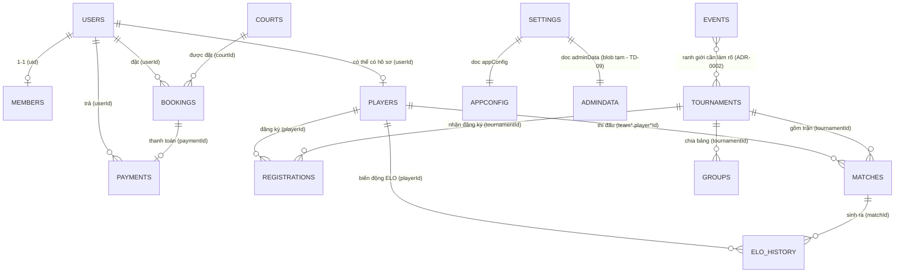

# ERD — Entity Relationship Diagram (AMZ Pickleball)

> Mô hình thực thể Firestore. Cập nhật: 2026-06-30. Nguồn: `firestore-schema.md`, code, `DATABASE.md`.
> Firestore là NoSQL → quan hệ là **logic** (ref bằng ID), không có ràng buộc khoá ngoại ở DB.

---

## 1. Sơ đồ quan hệ (Mermaid)

> Nếu trình xem không render Mermaid, dùng sơ đồ ASCII trong `DATABASE.md` mục 2.

---

## 2. Bảng thực thể & khoá

| Thực thể | Document ID | Khoá ngoại (logic) | Ghi chú |
|---|---|---|---|
| `users` | uid (= Auth UID) | — | role: admin/staff/member/guest |
| `players` | auto | userId→users | hồ sơ thi đấu (ELO/DUPR) |
| `courts` | auto | — | 8 sân |
| `bookings` | auto | courtId→courts, userId→users, paymentId→payments | dùng transaction chống double-book |
| `payments` | auto | bookingId→bookings, userId→users | **append-only** |
| `members` | uid | userId→users | gói hội viên |
| `tournaments` | auto | organizer→users | giải đấu |
| `registrations` | auto (top-level) | playerId/partnerId→players, tournamentId→tournaments | ⚠️ schema doc để sub-collection — chốt top-level (ADR-0002/DESIGN-firestore-rules) |
| `matches` | auto | tournamentId→tournaments, team*.player*Id→players | tính ELO |
| `elo_history` | auto | playerId/matchId/tournamentId/opponent*Id | **append-only, không sửa/xoá** |
| `groups` | auto | tournamentId→tournaments, chứa players[] | bảng đấu vòng tròn |
| `events` | auto | — | mục public/marketing (ranh giới với tournaments cần làm rõ) |
| `videos` | auto | — | video YouTube duyệt |
| `settings` | docId (`appConfig`,`adminData`) | — | cấu hình + blob tạm |
| `config` | docId | — | có trong rules, chưa có trong schema doc |

---

## 3. Quy tắc toàn vẹn (enforce ở app/rules, không ở DB)
- Xoá `players` KHÔNG được mồ côi `matches`/`elo_history` → chỉ đánh dấu `isActive=false`.
- `bookings` mới phải kiểm overlap thời gian trong transaction.
- `payments`, `elo_history` chỉ ghi thêm (rules cấm update/delete — xem DESIGN-firestore-rules).
- Trường denormalized (`bookings.playerName`, `registrations.playerName`) cần đồng bộ khi nguồn đổi.

---

## 4. Tham chiếu
- Field chi tiết → `firestore-schema.md`
- Trùng JSON & chuẩn hoá → `DATABASE.md`
- Versioning schema → `DATABASE_VERSIONING.md`
