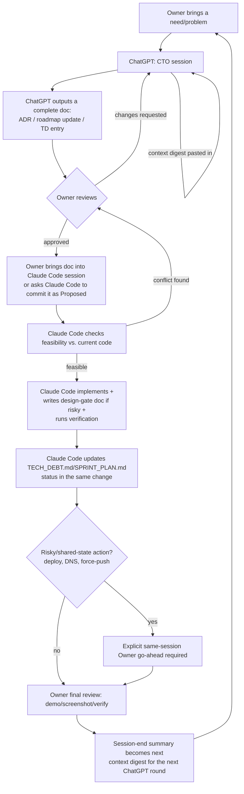

# Design Doc — AI Operating System Redesign

> **Status: PROPOSED (Draft)** — awaiting Project Owner review. Not implemented. No existing files modified.
> **Date:** 2026-07-04
> **Author:** Claude Code (drafting), for review by Project Owner + ChatGPT (CTO)
> **Related:** `CLAUDE.md`, `ARCHITECTURE.md`, `TECH_DEBT.md`, `MASTER_ROADMAP.md`, `SPRINT_PLAN.md`, `docs/adr/*`, `.claude/rules/*`, `.claude/agents/*`
> **Gate:** this is itself the design doc for a process change. See §13 for migration/rollback/acceptance (the same 4-part gate `TECH_DEBT.md` requires for Deploy/Firestore/Auth changes, applied here to *how the project is run*).

> **Nguồn sự thật (cập nhật 2026-07-04, sau khi `AMZ_BUSINESS_BLUEPRINT.md` và `AMZ_OS.md` ra đời):**
> - `AMZ_BUSINESS_BLUEPRINT.md` là nguồn sự thật duy nhất về **business** (tầm nhìn, mô hình, doanh thu, khách hàng, dữ liệu, AI, công nghệ ở cấp doanh nghiệp).
> - `AMZ_OS.md` là nguồn sự thật duy nhất về **cấu trúc vận hành** (domain nào, tổ chức theo tầng nào, liên kết ra sao).
> - Tài liệu này (`DESIGN-ai-operating-system.md`) **chỉ mô tả quy trình phối hợp AI** (ChatGPT ↔ Claude Code ↔ Project Owner) — nó không định nghĩa, không giả định, và không còn thẩm quyền nêu bất kỳ business domain nào. Mọi nội dung business bên dưới được viết **trước** khi hai tài liệu trên tồn tại; nơi nào còn sót nội dung business, hãy đọc theo nguồn ở trên, không theo tài liệu này.

---

## 0. Why this exists — findings from auditing the current CLAUDE.md

Before proposing anything new, here is what's actually true about the current setup:

1. **Content is duplicated across two layers.** `CLAUDE.md` contains full copies of design philosophy, tone-of-voice, and dev conventions that *also* live verbatim in `.claude/rules/company-info.md`, `content-guidelines.md`, `design-system.md`, `dev-conventions.md`, `mandatory-rules.md`, `tech-stack.md`. Two places to update, one of them will drift.
2. **No explicit authority model between the two AI systems.** `ARCHITECTURE.md`, `TECH_DEBT.md`, `MASTER_ROADMAP.md`, `SPRINT_PLAN.md` are all headed "Vai trò: CTO / Lead Architect" — evidence they were authored by an external strategy session (presumably ChatGPT) — while a `cto-advisor` subagent *also* exists inside Claude Code's own agent roster. Nothing says which one's word is final when they disagree.
3. **Docs drift from reality with no forcing function.** Confirmed this session: TD-01/02/03 were completed in commit `76bffaf` but `TECH_DEBT.md`/`MASTER_ROADMAP.md` still list them as open P0s days later. `ADR-0004`'s header said "Accepted — 2026-07-02" while its own body text still said "Chưa chốt" (not decided) — the doc contradicted itself. **Fixed 2026-07-04:** the stale "Chưa chốt" section was removed and merged into the single Accepted decision.
4. **No shared memory mechanism across the two AI systems.** ChatGPT sessions don't persist; Claude Code's memory is local to this machine. The repo itself is the only thing both can reliably read — but nothing states that as a rule, so context currently leaks through ad hoc copy-pasting.
5. **Testing has no teeth.** `package.json` root `test` script is `exit 1`; TD-08 (CI test/lint/build) is un-started. Every "Definition of Done" in `SPRINT_PLAN.md` currently relies on manual verification only.
6. **Thirteen-plus markdown files with overlapping scope** (`ARCHITECTURE.md`, `DATABASE.md`, `DEPLOYMENT.md`, `MASTER_ROADMAP.md`, `SPRINT_PLAN.md`, `TECH_DEBT.md`, `SECURITY.md`, `CLAUDE.md`, `docs/adr/*`, `docs/design/*`, `docs/runbooks/*`) with no single "read this first, in this order" index.

This proposal's job is to fix these five things, not to re-litigate the technical decisions already made in `ARCHITECTURE.md`/`DATABASE.md`/`DEPLOYMENT.md` (those stand).

---

## 1. Project Vision

**Product/business vision:** not restated here — see `AMZ_BUSINESS_BLUEPRINT.md` §1 for the canonical vision. This document does not define or assert business vision content.

**AI-OS vision (what this doc is actually about):** This project is co-engineered by one Project Owner and two AI systems operating at different altitudes — an external strategic layer (ChatGPT, "CTO") and a resident execution layer (Claude Code, "Senior Engineer"). The organizing principle:

> **The git repository is the only shared brain.** No decision, plan, or piece of context is real until it exists as a committed file. Chat history is not a source of truth for either AI — if it isn't in the repo, it didn't happen.

This resolves the memory-continuity problem in §0.4 by construction rather than by hoping people remember to copy-paste correctly.

---

## 2. Business Goals

> These are goals *for the AI-OS workflow itself* (why this process should exist), not a restatement of AMZ's business goals — those live in `AMZ_BUSINESS_BLUEPRINT.md` §5.

The AI-OS redesign exists to serve these, not as ceremony for its own sake:

1. **Protect the running business.** `amzpickleball.vn` is live production, not a prototype — every process rule here should reduce the odds of a repeat of the P0 auth/deploy incidents already found and fixed.
2. **Minimize Project Owner time cost.** One person is the bottleneck for every approval. Docs and workflow must let them re-enter context in minutes, not re-explain history every session.
3. **De-risk `app-nextjs` becoming revenue-bearing** (bookings, memberships, tournament fees) — nothing here should get shipped past the ADR-0004 phase gate by process failure rather than deliberate choice.
4. **Keep process lightweight.** This is a 1-owner, AI-assisted project, not an enterprise engineering org. Every rule below is sized for that — no ceremony that doesn't pay for itself.
5. **Make technical debt visible and decaying, not permanent.** `TECH_DEBT.md` is a good instrument already; the AI-OS should guarantee it stays synced with reality (see §0.3).

---

## 3. Technical Architecture (of the AI Operating System itself)

A four-layer model, replacing the current implicit/undocumented one:

```
Layer 0 — Source of Truth
  The git repo. Every doc, rule, ADR, and ATT (agent task tracking) file lives here.
  Neither AI trusts its own chat memory over what's committed.

Layer 1 — Strategic Layer  (ChatGPT, "CTO")
  Runs outside the repo (separate tool, no file access).
  Produces/updates: ARCHITECTURE.md, MASTER_ROADMAP.md, TECH_DEBT.md, ADRs.
  Input: a context digest the Owner brings in (see §12).
  Output: complete replacement documents — never partial deltas that require
  someone to remember how to merge them by hand.

Layer 2 — Execution Layer  (Claude Code, "Senior Engineer")
  Runs inside the repo, has file/tool access.
  Reads Layer 1 docs, turns ADRs/Sprint Plan items into working code,
  writes design-gate docs for its own proposals, runs verification,
  keeps TECH_DEBT.md/SPRINT_PLAN.md status current in the same commit
  that changes the underlying reality.

Layer 3 — Specialist Subagents (.claude/agents/*)
  cto-advisor, researcher, tao-noi-dung-pickleball, thiet-ke-creative,
  kinh-doanh-pickleball — serve domains active in AMZ_OS.md.
  coaching-pickleball-business, ai-agency — exist as agent files but are
  DORMANT: not mapped to any active domain in AMZ_OS.md (Coaching and
  AI Agency are future possibilities per AMZ_BUSINESS_BLUEPRINT.md, not
  current business domains).
  Narrow-scope helpers invoked by Claude Code or the Owner directly.
  None of these can accept/close an ADR — see §7 for the authority fix.

Layer 4 — Human Authority (Project Owner)
  Sole approver of gated changes. Final call on business priority,
  ADR acceptance, and anything hard-to-reverse (deploy, DNS, force-push).
```

Key structural fix vs. today: Layer 1 and Layer 2 currently overlap with no arbitration rule (§0.2). §7 makes this explicit.

---

## 4. Development Rules

1. **Gate rule (existing, keep, generalize):** any change touching Deploy, Firestore rules, or Auth requires the 4-part gate already defined in `TECH_DEBT.md` §3 (design doc + migration + rollback + acceptance criteria) before it ships. This proposal extends the *habit* of gating to process changes too (see §13), not just infra changes.
2. **No silent scope creep.** If Claude Code discovers new work while implementing a task, it becomes a new `TD-XX` entry in `TECH_DEBT.md` — it does not get done silently in the same change unless the Owner explicitly asks for it.
3. **No unilateral deploys.** Claude Code never runs `vercel --prod`, `firebase deploy`, or a DNS change without an explicit go-ahead in the *current* session, even if a design doc pre-approved the change in principle. (This matches the existing "hard-to-reverse action" policy Claude Code already operates under — stating it here makes it a project rule, not just a tool-level default.)
4. **Docs update in the same commit as the reality they describe.** The TD-01-marked-done-but-docs-said-open drift found this session is the exact failure mode this rule targets.
5. **Secrets never leave the repo's execution boundary.** `GITHUB_TOKEN`, `FIREBASE_API_KEY` (server-side use), `ADMIN_PASSWORD_HASH` are handled only by Claude Code via env vars — never pasted into a ChatGPT session, never logged in an ADR/design doc.
6. **ADRs are immutable once Accepted.** A change of mind produces a *new* ADR that supersedes the old one; the old one is never edited to look like it always said the new thing.

---

## 5. Coding Standards

No change to the substance of `.claude/rules/dev-conventions.md` (mobile-first CSS, semantic HTML, no comments unless the *why* is non-obvious, `IntersectionObserver` over scroll listeners, etc.) — that file remains canonical and is referenced, not copied, from `CLAUDE.md` (see §6). Additions specific to the AI-OS:

- Every non-trivial commit from Claude Code names the `TD-XX`/ADR it addresses in the commit body — makes `git log` cross-referenceable with `TECH_DEBT.md` without extra tooling.
- No speculative abstractions (already a system-level rule; restated here so it's discoverable by reading project docs alone, not just the system prompt).
- Any change to `players`/`events`/`tournaments` shape must update **both** consumers (static site JSON export path and `app-nextjs` Firestore reads) in the same change — this is the concrete coding-standard consequence of TD-06.

---

## 6. Repository Structure

Proposed reorganization (structural only — **not executed by this doc**; see §13 for how this would roll out):

```
/CLAUDE.md                      ← becomes a ~1-page INDEX + current sprint pointer.
                                   No duplicated content — every section links to
                                   the file that actually owns that information.
/docs/
  /ai-os/                        ← NEW
    ROLES.md                     ← §7 of this doc, extracted to its own file
    WORKFLOW.md                  ← §12 of this doc, extracted to its own file
  /strategy/                     ← ARCHITECTURE.md, DATABASE.md, DEPLOYMENT.md,
                                   MASTER_ROADMAP.md, SPRINT_PLAN.md, TECH_DEBT.md
                                   (moved from root, or left at root — Owner's call,
                                   not a functional requirement)
  /adr/                          ← unchanged, already correct
  /design/                       ← unchanged, already correct (this doc lives here)
  /runbooks/                     ← unchanged, already correct
.claude/
  rules/                         ← unchanged; becomes the ONLY place detail-level
                                   rules live (CLAUDE.md stops duplicating it)
  agents/                        ← unchanged
```

The only functional problem being solved here is **duplication** (§0.1), not file location — moving root docs into `/docs/strategy/` is optional polish and lower priority than de-duplicating `CLAUDE.md`.

---

## 7. AI Agent Roles

| Role | Who | Has authority to | Does **not** have authority to |
|---|---|---|---|
| CTO / Chief Architect | ChatGPT (external) | Author/update ADRs, `MASTER_ROADMAP.md`, `TECH_DEBT.md` priorities; review major designs | Touch the repo directly; deploy; unilaterally accept a gated change (Owner must still approve) |
| Senior Engineer | Claude Code (this tool) | Implement, refactor, write design-gate docs for its own proposals, run verification, keep TD/Sprint status current | Change an Accepted ADR's decision; deploy prod / force-push / delete branches without same-session confirmation; bypass the Deploy/Firestore/Auth gate |
| Strategy sounding board | `cto-advisor` subagent | Give fast internal "what would a CTO say" opinions during a Claude Code session; draft option lists | Close/accept an ADR or TD priority — anything ADR-worthy must be escalated to the real CTO layer (ChatGPT) + Owner |
| Domain specialists | `researcher`, `tao-noi-dung-pickleball`, `thiet-ke-creative`, `kinh-doanh-pickleball` (active domains); `coaching-pickleball-business`, `ai-agency` (**dormant** — not mapped to any active domain in `AMZ_OS.md`) | Narrow domain output (content, business copy, design direction) | Architecture, security, or deploy decisions; dormant agents have no domain to act on until reactivated by a business decision |
| Project Owner | Human | Final approval on all gated changes; business priority calls; ADR acceptance | — |

This directly resolves §0.2: `cto-advisor` is downgraded from an undefined peer of the external CTO to an explicitly subordinate, fast-opinion tool. It cannot originate a Layer-1 document.

---

## 8. Deployment Strategy

No change to the underlying technical decision in `DEPLOYMENT.md` (Vercel is the single host; Firebase is Firestore-only). AI-OS-specific additions:

- Claude Code never triggers a production deploy, DNS change, or `firebase deploy --only firestore:rules` without an explicit go-ahead in the current session — regardless of whether a design doc already approved the change in principle (matches Rule §4.3; restated here because deploy is the highest-blast-radius action in this project).
- `app-nextjs` follows the phase gate already set in `ADR-0004`: preview-only (`*.vercel.app`) until real booking (`createBooking()`) and an auth flow exist; subdomain (`app.amzpickleball.vn`) is not attached until then. This proposal does not change that gate — it just states that the AI-OS must not let that gate get skipped by process drift (e.g., someone attaching the subdomain because "it's basically done").

---

## 9. Security Policy

Cross-references `SECURITY.md` as canonical; adds AI-specific clauses:

- Neither AI ever echoes secret values (`GITHUB_TOKEN`, `ADMIN_PASSWORD_HASH`, Firebase server keys) into a transcript — ChatGPT sessions especially, since that's a third-party service outside this repo's control.
- The TD-02 pattern (verify token **and** check identity, never validity-only) is the template for every future privileged endpoint — code review by Claude Code should treat "checks token validity only" as a blocking finding by default.
- Any Firestore rules change is emulator-tested **and** committed to git before being called done — this session found rules already published to Firebase Console but not committed; that sequence (Console-first, git-later) is now explicitly disallowed. Git commit is the record of truth; Console is just where it gets applied.

---

## 10. Testing Strategy

Current state is close to zero (root `test` = `exit 1`, TD-08 not started). Proposed tiers, ordered by what unblocks what:

| Tier | What | Blocks |
|---|---|---|
| 1 | Firestore Rules emulator tests, one per collection | Sign-off on TD-04/TD-06 completion |
| 2 | `next lint` + `tsc --noEmit` in CI for `app-nextjs` | TD-08; app-nextjs going past preview |
| 3 | Playwright smoke tests for golden paths (site loads, admin login works, booking flow once real) — `playwright` is already a dependency, currently unused for gating | Any claim that a golden path "works" without a human re-checking it every time |
| 4 | Manual `/verify` pass + screenshot-vs-design-reference (already mandated in `mandatory-rules.md`) | Any UI-affecting change being called done |

This turns "we have no tests" from an ambient, silently-accepted fact into a tracked, prioritized item — which it already technically is (TD-08) but with no forcing function today.

---

## 11. Documentation Rules

1. Every strategy doc (`ARCHITECTURE.md`, `DATABASE.md`, `DEPLOYMENT.md`, `MASTER_ROADMAP.md`, `SPRINT_PLAN.md`, `TECH_DEBT.md`) carries a "Cập nhật" date and **must** be updated in the same commit that changes the reality it describes. This is the single highest-value rule in this proposal — it directly targets the two drift bugs found this session (§0.3).
2. ADRs are immutable once Accepted (restated from §4.6) — a change of mind is a new ADR, not an edit.
3. Design docs in `docs/design/` close with a final status (`APPROVED` / `IMPLEMENTED` / `SUPERSEDED`) and link the ADR + runbook that executed them — most already do this; make it mandatory for all.
4. `CLAUDE.md` is the only file a new session should need to read first. If `CLAUDE.md` doesn't point to something, that something is not official project state — this is the forcing function against the doc-sprawl problem in §0.6.

---

## 12. Collaboration Workflow — ChatGPT (CTO) / Claude Code (Senior Engineer) / Project Owner



**In words:**

1. Owner brings a business need to ChatGPT, pasting in whatever current-state digest is needed (ideally just "read `CLAUDE.md`" once this proposal's slimming is done).
2. ChatGPT returns a **complete** document — a new/updated ADR, roadmap entry, or TD item — never a verbal-only decision or a partial diff.
3. Owner reviews and approves (or sends it back for revision).
4. The approved doc gets into the repo — either the Owner pastes it in and asks Claude Code to commit it as `Proposed`, or Claude Code drafts the commit from what the Owner relays.
5. Claude Code checks the doc against actual code state and flags conflicts *before* implementing (e.g., "this ADR assumes X but the code currently does Y") — this is exactly the kind of contradiction found in `ADR-0004` this session, and should be caught here instead of discovered later.
6. Claude Code implements, writes the design-gate artifacts if the change is Deploy/Firestore/Auth-class risk, and runs verification.
7. Status docs (`TECH_DEBT.md`, `SPRINT_PLAN.md`) are updated in the *same* change — not as a follow-up.
8. Anything hard-to-reverse or shared-state (deploy, DNS, force-push) still requires an explicit same-session go-ahead from the Owner, even if the design doc was pre-approved in principle.
9. The loop closes: whatever Claude Code reports at session end is the material the Owner carries back into the next ChatGPT strategy session — keeping Layer 0 (the repo) as the only thing either AI has to trust.

---

## 13. Gate — Migration / Rollback / Acceptance Criteria

*(Following this project's own house convention for process changes, per `TECH_DEBT.md` §3.)*

### Migration plan (phased, non-destructive — nothing here happens until approved)

| Phase | Action | Owner |
|---|---|---|
| P1 | Owner reviews this doc, approves/edits in place | Project Owner |
| P2 | Extract §7 → `docs/ai-os/ROLES.md`, §12 → `docs/ai-os/WORKFLOW.md` | Claude Code |
| P3 | Slim `CLAUDE.md` down to index-only; remove content duplicated in `.claude/rules/*` | Claude Code |
| P4 | Backfill "Cập nhật" date discipline: do a one-time pass reconciling `TECH_DEBT.md`/`MASTER_ROADMAP.md` against actual git state (fixes the TD-01 drift found this session) | Claude Code |
| P5 | Fix `ADR-0004`'s internal contradiction (header vs. body) as its own small commit | Claude Code |
| P6 | (Optional, lower priority) Move root strategy docs into `docs/strategy/` | Claude Code, only if Owner wants the file-location change |

### Rollback plan
- Every phase above is a separate, revertable git commit (`git revert <sha>`). Pure documentation/process change — no runtime, deploy, or data impact, so rollback is trivially safe (unlike the Deploy/Firestore-class gates this convention normally guards).

### Acceptance criteria
- [ ] `CLAUDE.md` contains no content that's a verbatim duplicate of a `.claude/rules/*.md` file.
- [ ] `docs/ai-os/ROLES.md` and `WORKFLOW.md` exist and are linked from `CLAUDE.md`.
- [ ] `TECH_DEBT.md` and `MASTER_ROADMAP.md` reflect the actual current state of TD-01 through TD-06 (no doc says "open" for something already merged).
- [ ] `ADR-0004` no longer contradicts itself between header and body.
- [ ] The next ADR produced by a ChatGPT session is a complete-document output (not a chat-only decision), demonstrating the §12 workflow is actually being followed.
